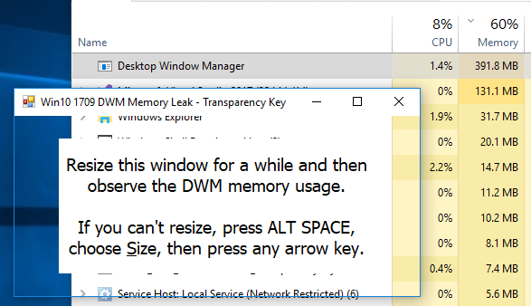

# Win10 (1709) + TransparencyKey = DWM Memory Leak

This repo hosts a simple WinForms C# project for demonstration purpose.

In case you don't know what is `TransparencyKey`, you may refer to MSDN here: https://msdn.microsoft.com/en-us/library/system.windows.forms.form.transparencykey(v=vs.110).aspx

In short, it calls a WinAPI known as `SetLayeredWindowAttributes` with `LWA_COLORKEY` flag to make any part in current window with specified color to be transparent.

When this feature is used under Windows 10 Fall Creators Update (version 1709), I found that the memory usage of DWM increased to abnormal level, and it would not free up unless I killed the DWM.exe process, forcing DWM to restart itself.

There is [a mention of it on MSDN forum](https://social.technet.microsoft.com/Forums/windows/en-US/a4594475-9676-4278-8e41-0fd26e4f5739/dwm-memory-leak-window-64b-1709?forum=win10itprohardware) but unfortunately the reply from MSFT is 変わらずに disappointing, so I decided to post this up on GitHub, hoping that more developers would be aware of this.

The testing platform is on build 16299.309. The bug does not exist in build 17133.1 (the cancelled RTM build of Spring Creators Update).
